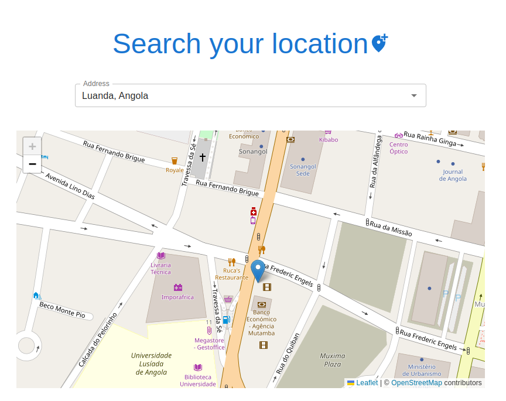

This is a simple address to map app built with NextJs + Google places API

Run on your browser: https://location-map.vercel.app/

## Screenshots



## Installation

First, clone the repo and then, use the package manager yarn or npm to install dependencies:

```bash
npm install
# or
yarn
```

## Getting Started

First, run the development server:

```bash
npm run dev
# or
yarn dev
```

Open [http://localhost:3000](http://localhost:3000) with your browser to see the result.

## Contributing

Pull requests are welcome. For major changes, please open an issue first to discuss what you would like to change.
